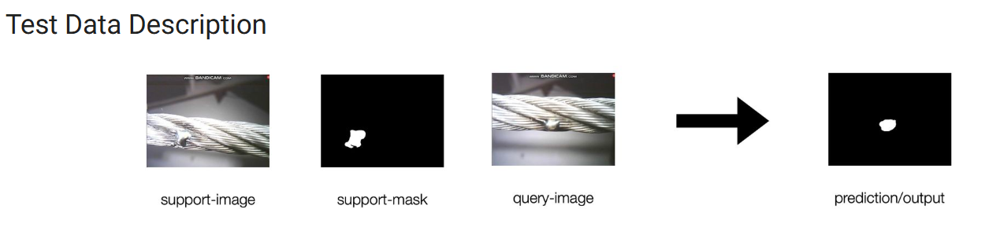

# FPTrans: Feature-Proxy Transformer for Few-Shot Segmentation Applied for Industrial Defect Segmentation

[Jian-Wei Zhang](https://github.com/Jarvis73), Yifan Sun, Yi Yang, Wei Chen

[[arXiv](https://arxiv.org/abs/2210.06908)][[Bibtex](https://github.com/Jarvis73/FPTrans#CitingFPTrans)]

This repository is the **PyTorch** Implementation. One can find the PaddlePaddle implementation from [here](https://github.com/Jarvis73/FPTransPaddle).


## Defect Segmentation Testing Phase

## Installation

Create a virtual environment and install the required packages.

```bash
conda create -n fptrans python=3.9.7
conda activate fptrans
conda install numpy=1.21.2
conda install pytorch==1.10.0 torchvision==0.11.1 cudatoolkit=11.3 -c pytorch
conda install tqdm scipy pyyaml
pip install git+https://github.com/IDSIA/sacred.git@0.8.3
pip install dropblock pycocotools opencv-python
```

Put following bash function in `~/.bashrc` for simplifying the `CUDA_VISIBLE_DEVICES`. 

```bash
function cuda()
{
    if [ "$#" -eq 0 ]; then
        return
    fi
    GPU_ID=$1
    shift 1
    CUDA_VISIBLE_DEVICES="$GPU_ID" $@
}
```

Now we can use `cuda 0 python` for single GPU and `cuda 0,1 python` for multiple GPUs. 

## Getting Started

See [Preparing Datasets and Pretrained Backbones for FPTrans](./data/README.md)

### Usage for inference with our pretrained models


| Datasets  | Backbone  | #Shots |
|:---------:|:---------:|:------:|
| VISION24  | ViT-B/16  | 1-shot |


Run the `test` command:

```bash
# VISION24 ViT 1shot
cuda 0 python run.py test with configs/vision24_vit.yml exp_id=1 split=0


```

### Usage for training from scratch

Run the `train` command (adjust batch size `bs` for adapting the GPU memory):

```bash
# VISION24 1shot
cuda 0 python run.py train with split=0 configs/vision24_vit.yml

```

Optional arguments:

* `-i <Number>`: Specify the experiment id. Default is incremental numbers in the `./output` directory (or MongoDB if used).
* `-p`: print configurations
* `-u`: Run command without saving experiment details. (used for debug)

Please refer to [Sacred Documentation](https://sacred.readthedocs.io/en/stable/index.html) for complete command line interface. 

### Performance


Notice that the results are obtained on NVIDIA A100/V100 platform. We find that the results
may have a few fluctuation on NVIDIA GeForce 3090 with exactly the same model and environment.

## Citing FPTrans

```text
@inproceedings{zhang2022FPTrans,
  title={Feature-Proxy Transformer for Few-Shot Segmentation},
  author={Jian-Wei Zhang, Yifan Sun, Yi Yang, Wei Chen},
  journal={NeurIPS},
  year={2022}
}
```
